# تصميم تطبيق يدي باشاك للتبرعات — الإصدار 1.0 (الخطوة الأولى من التنفيذ)

**ملف Figma:** https://www.figma.com/design/9QjfqCpz5QB1ulRk73yTVg
**التاريخ:** 5 أكتوبر 2026 | **الحالة:** جولة أولى (أساس تقني ومسار التبرع فقط). تقييمها الصريح وخطة رفعها إلى مستوى احترافي كامل في `DESIGN-DEVELOPMENT-PLAN.md` | **المرجع:** خطة العمل في `../market-study-and-plan.md` (القسم 6 نطاق الإصدار الأول، والقسم 19 تحليل الجمعية)

---

## 1. ما أُنجز

ملف Figma متكامل مبني بالكامل على نظام تصميم (متغيرات، أنماط نص، مكوّنات) لا على أشكال مرسومة يدوياً، ويحتوي خمس صفحات:

| الصفحة | المحتوى |
|---|---|
| 📘 Cover | غلاف الملف وفهرس الصفحات |
| 🎨 Foundations | 33 لوناً أساسياً، 29 لوناً دلالياً بوضعَي الفاتح والداكن، 9 قيم مسافات، 6 قيم زوايا، 6 أحجام، 14 نمط نص Cairo/Inter، 4 أنماط ظل، مع لوحة عرض لكل منها |
| 🧩 Components | 31 أيقونة، وزر بـ 18 حالة (3 أنماط × 3 حالات × حجمين)، أزرار Apple Pay وGoogle Pay، شريحة المبلغ، 5 شارات، شريط تقدّم RTL، صف الأمان، حقل إدخال بـ 4 حالات، محدد التكرار (يومي/أسبوعي/شهري)، شريحة التصنيف، مفتاح تبديل RTL، عدّاد كمية، بطاقة الحملة، شريط التنقل بـ 4 حالات مع زر التبرع العائم، شريط العنوان بنمطين، صف الاشتراك، بطاقة الأثر، شريط حالة iOS ومؤشر الرئيسية |
| 📱 Screens – AR | 12 شاشة iPhone (393×852) بالعربية وRTL كامل، مرتبطة كلها بالمكوّنات والمتغيرات، مع نسخة الوضع الداكن |
| 🔀 Flows & Notes | رحلة التبرع كضيف (3 نقرات)، رحلة التبرع الدوري، مبادئ التصميم، ملاحظات التسليم لفريق Flutter، وما تبقّى للإصدار 1.1 |

---

## 2. مبادئ التصميم التي تحكم كل شاشة

1. **التبرع قبل التسجيل.** لا توجد شاشة تسجيل إجبارية قبل أول تبرع. التسجيل عرضٌ بعد النجاح برمز تحقق واحد.
2. **ثلاث نقرات إلى الدفع.** الحملة، المبلغ، التأكيد بالبصمة. أي شاشة إضافية تحتاج تبريراً مكتوباً.
3. **المحفظة أولاً.** زر Apple Pay (أو Google Pay على Android) يظهر فوق خيار البطاقة دائماً وبلون المنصة الأصلي.
4. **العربية أولاً.** خط Cairo، اتجاه RTL كامل، والتركية والإنجليزية من اليوم الأول.
5. **الثقة ظاهرة.** صف "دفع آمن ومشفّر عبر Stripe" تحت كل زر دفع، وأوجه الصرف داخل صفحة الحملة.
6. **الشفافية بعد الدفع.** إيصال فوري، ثم تحديث أثر شخصي في شاشة "أثري".
7. **إمكانية الوصول.** أهداف لمس 48 نقطة فأكثر، تباين AA، أحجام نص قابلة للتكبير.

---

## 3. الشاشات

| # | الشاشة | الهدف | ما يميزها |
|---|---|---|---|
| 01 | الترحيب | إدخال المستخدم خلال 5 ثوانٍ | زر "تصفّح وتبرّع كضيف" هو الأبرز، ثم الدخول بالجوال، ثم Apple/Google |
| 02 | الرئيسية | تبرع في 10 ثوانٍ من الشاشة الأولى | بطاقة "تبرع سريع" بمبالغ مقترحة وApple Pay مباشرة، حملة عاجلة، تصنيفات، بطاقات حملات بشريط تقدّم |
| 03 | تفاصيل الحملة | إقناع وتبرع | أثر كل $5، نسبة الإنجاز، أوجه الصرف، تحديثات أثر، شريط ثابت أسفل الشاشة بعدّاد كمية وزر تبرع |
| 04 | ورقة التبرع | إتمام الدفع دون مغادرة الحملة | مبلغ أو كمية، نوع التبرع (صدقة/زكاة/عام)، مفتاح "اجعله دورياً"، Apple Pay ثم البطاقة كخيار ثانٍ |
| 05 | التبرع الدوري | إعداد اشتراك يومي/أسبوعي/شهري | محدد التكرار، اختيار اليوم (الجمعة افتراضياً)، ملخص بلغة واضحة، مدة الاشتراك، Apple Pay دوري |
| 06 | النجاح | تثبيت الأثر وتحويل المتبرع | رقم الإيصال، "أثرك اليوم"، عرض التحويل إلى دوري، حفظ الحساب برقم الجوال |
| 07a | الدخول بالجوال | تسجيل بلا كلمات مرور | رمز دولة، إرسال عبر واتساب أو SMS، Apple/Google كبديل، ربط الحسابات القديمة تلقائياً |
| 07b | رمز التحقق | تأكيد في ثوانٍ | 6 خانات بملء تلقائي، عدّاد إعادة الإرسال، بديل واتساب |
| 08 | أثري | الاحتفاظ بالمتبرع | إجمالي العطاء، 4 بطاقات أثر، الاشتراكات النشطة، آخر تحديثات الأثر |
| 09 | إدارة الاشتراك | إدارة ذاتية كاملة | المبلغ والتكرار، وسيلة الدفع (رمز Apple Pay دائم)، إيقاف مؤقت، تذكير قبل الخصم، سجل الخصومات مع إعادة المحاولة التلقائية، إلغاء |
| 10 | كفالة يتيم | أول حالة استخدام للاشتراك الشهري | عدد الأيتام، 3 أنواع كفالة بالأسعار، موقع اليتيم، الكفالة نيابة عن آخر، ملخص شهري وApple Pay |
| 11 | الرئيسية (داكن) | إثبات نظام الألوان | النسخة نفسها بتبديل وضع مجموعة الألوان فقط، دون أي تعديل يدوي |

### معاينات

| | | |
|---|---|---|
| 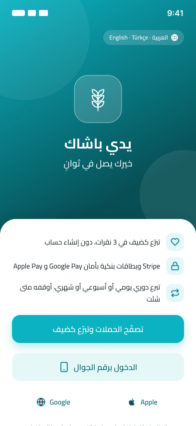 | 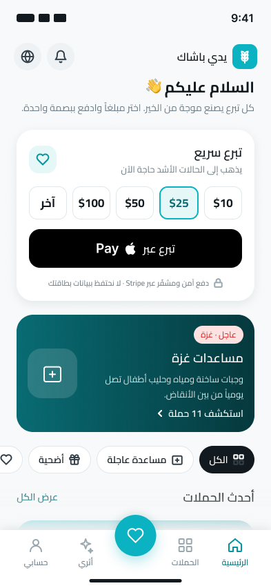 | 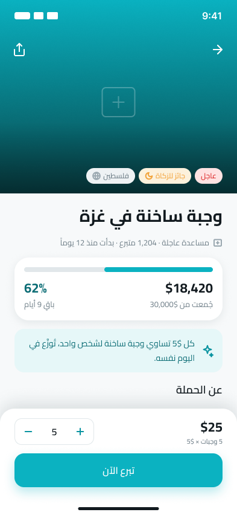 |
| 01 الترحيب | 02 الرئيسية | 03 تفاصيل الحملة |
| 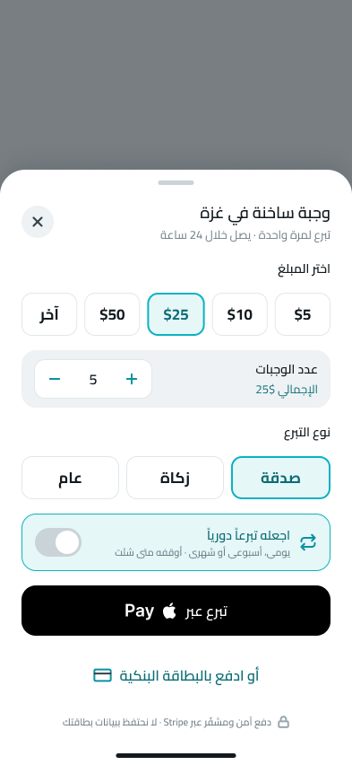 | 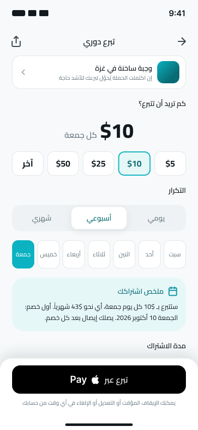 | 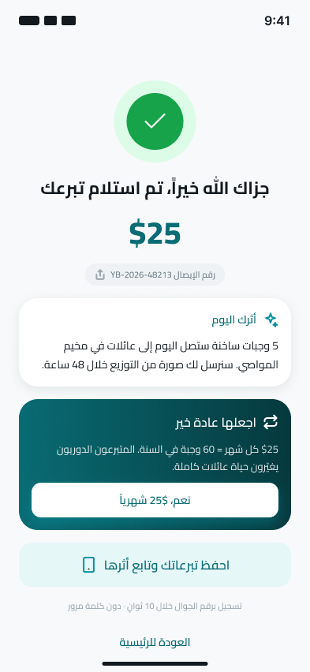 |
| 04 ورقة التبرع | 05 التبرع الدوري | 06 النجاح |
| 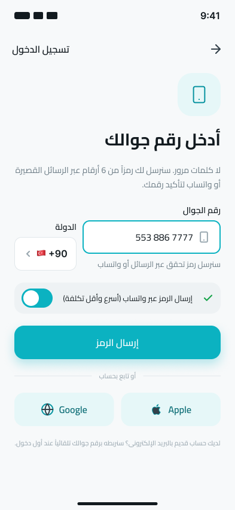 | 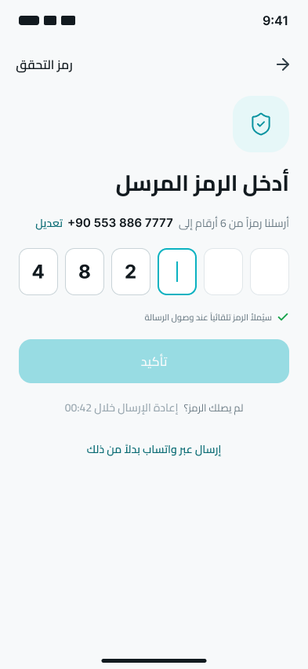 | 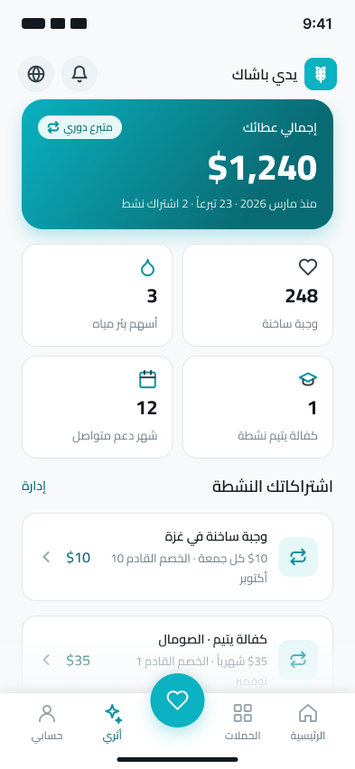 |
| 07a الدخول بالجوال | 07b رمز التحقق | 08 أثري |
| 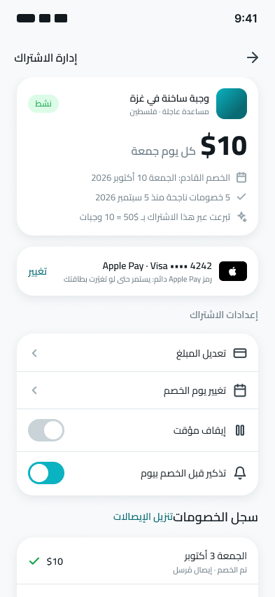 | 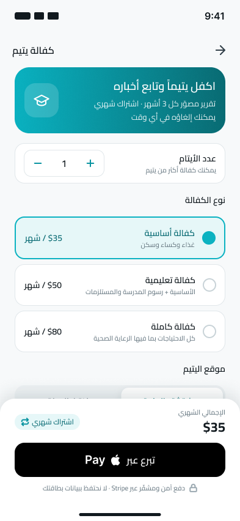 | 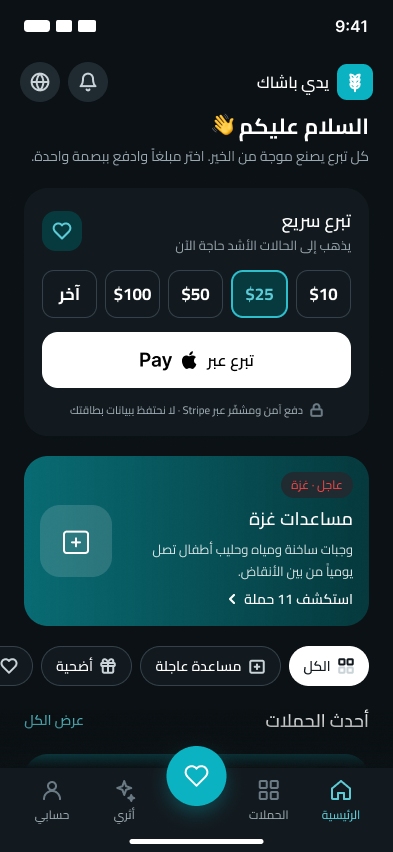 |
| 09 إدارة الاشتراك | 10 كفالة يتيم | 11 الوضع الداكن |

---

## 4. نظام التصميم (Design Tokens)

### الألوان

مجموعة **Primitives** (قيمة واحدة): سلّم teal من 50 إلى 900 حول لون الهوية الحالي للموقع، وسلّم slate محايد من 0 إلى 950، وذهبي للزكاة والتنبيهات اللطيفة، وأخضر وأحمر للحالات.

مجموعة **Color** (وضعان Light وDark) وكل متغير فيها مرجع (alias) إلى لون أساسي، مع Code Syntax للويب وFlutter وiOS:

| المتغير | الفاتح | الداكن | الاستخدام |
|---|---|---|---|
| color/bg/canvas | slate/50 | slate/950 | خلفية الشاشة |
| color/bg/surface | slate/0 | slate/900 | البطاقات والأوراق |
| color/bg/brand | teal/500 | teal/500 | الزر الرئيسي، الزر العائم، التقدّم |
| color/bg/brand-soft | teal/50 | teal/900 | الخلفيات الناعمة للتحديد والمعلومات |
| color/bg/applepay | black | slate/0 | زر Apple Pay وفق إرشادات Apple |
| color/text/primary | slate/900 | slate/0 | النص الأساسي |
| color/text/secondary | slate/500 | slate/400 | النص الثانوي |
| color/text/brand | teal/700 | teal/300 | الروابط والقيم المميزة |
| color/accent/gold | gold/500 | gold/400 | شارة "جائز للزكاة" |
| color/status/success | green/600 | green/500 | النجاح والتأكيد |
| color/status/error | red/600 | red/500 | الأخطاء والعاجل |

### المسافات والزوايا والأحجام

| الرمز | القيمة | الاستخدام |
|---|---|---|
| space/1 إلى space/12 | 4، 8، 12، 16، 20، 24، 32، 40، 48 | شبكة 4 نقاط. الحشو الأفقي للشاشة 24 |
| radius/xs إلى radius/full | 6، 8، 12، 16، 24، pill | 12 للحقول والشرائح، 16 للأزرار والصفوف، 24 للبطاقات والأوراق |
| size/touch | 48 | الحد الأدنى لأي هدف لمس |
| size/button | 56 | ارتفاع الأزرار الرئيسية وأزرار المحافظ |
| size/nav | 84 | ارتفاع شريط التنقل |

### الطباعة (Cairo)

| النمط | الخط | الحجم/السطر | الاستخدام |
|---|---|---|---|
| display/amount | Cairo ExtraBold | 40/48 | المبالغ الكبيرة |
| heading/xl | Cairo Bold | 28/38 | عناوين الشاشات الرئيسية |
| heading/lg | Cairo Bold | 22/32 | المبالغ في البطاقات، العناوين الثانوية |
| heading/md | Cairo SemiBold | 18/28 | عناوين الأقسام والبطاقات |
| heading/sm | Cairo SemiBold | 16/26 | عناوين شريط العنوان والصفوف |
| body/lg, body/md, body/sm | Cairo Regular | 16/28، 14/24، 13/22 | النصوص |
| label/lg, label/md, label/sm | Cairo SemiBold/Medium | 16/24، 14/22، 12/18 | الأزرار والشرائح والشارات |
| caption | Cairo Medium | 11/16 | صف الأمان والملاحظات |
| latin/label | Inter Semi Bold | 15/20 | كلمة "Pay" في أزرار المحافظ والأرقام اللاتينية |

### الظلال

shadow/card (البطاقات)، shadow/sheet (الأوراق السفلية والأشرطة الثابتة)، shadow/brand-button (الزر الرئيسي والزر العائم)، shadow/nav (شريط التنقل).

---

## 5. قرارات تصميمية تستحق الانتباه

- **زر التبرع العائم في منتصف شريط التنقل** يفتح ورقة التبرع السريع من أي شاشة. هذا يحقق هدف "التبرع في ثوانٍ" دون العودة إلى الرئيسية.
- **مفتاح "اجعله تبرعاً دورياً" داخل ورقة التبرع** هو المدخل الأول للاشتراكات، ثم شاشة النجاح، ثم بطاقة الحملة. ثلاثة مداخل بدل زر واحد مخفي.
- **اختيار اليوم في التبرع الأسبوعي** يعرض الجمعة محدَّدة افتراضياً، لأن "كل جمعة" له معنى ديني خاص عند المتبرع العربي.
- **ملخص الاشتراك بلغة بشرية** ("ستتبرع بـ $10 كل جمعة، أي نحو $43 شهرياً، أول خصم الجمعة 10 أكتوبر") يخفض التردد ويمنع المفاجآت.
- **سجل الخصومات يُظهر إعادة المحاولة التلقائية** صراحة ("تعذّر الخصم ثم نجحت إعادة المحاولة")، وهو ما يميز التطبيق عن المنافسين الذين يُفشِلون بصمت.
- **رمز Apple Pay الدائم** مذكور للمتبرع في شاشة إدارة الاشتراك ("يستمر حتى لو تغيّرت بطاقتك") لأنه ميزة احتفاظ حقيقية.
- **شارة "جائز للزكاة" ذهبية** على البطاقات، لأن التصنيف الشرعي هو أول سؤال يطرحه المتبرع.
- **الصور في الملف تدرجات مؤقتة** تُستبدل بصور الميدان من فريق إعلام الجمعية. لم تُستخدم صور مولّدة حتى لا تُقدَّم كصور حقيقية.

---

## 6. ملاحظات التسليم لفريق Flutter

- كل لون في الشاشات مربوط بمتغير من مجموعة Color، وتبديل الوضع الداكن يتم بتغيير الوضع فقط (الشاشة 11 دليل على ذلك). في Flutter يقابلها `ThemeExtension` واحد بقيمتَي light وdark، وأسماء الحقول موجودة في Code Syntax لكل متغير (مثل `AppColors.bgBrand`).
- المسافات والزوايا متغيرات FLOAT قابلة للقراءة من Figma مباشرة.
- أنماط النص تحمل في وصفها اسم Flutter المقترح (مثل `AppText.headingLg`).
- الأيقونات 31 مكوّناً بخط 2 نقطة على شبكة 24، تُصدَّر SVG وتُلوَّن في التطبيق عبر اللون الحالي.
- الاتجاه RTL في Figma رُتّب يدوياً من اليمين إلى اليسار؛ في Flutter يُدار بـ `Directionality` وسيُقلب تلقائياً للإنجليزية.
- زر Apple Pay يتبع إرشادات Apple: أسود في الفاتح وأبيض في الداكن، ونصه "تبرع عبر  Pay". في Flutter يُستخدم زر المنصة الأصلي عبر حزمة flutter_stripe لا نسخة مرسومة.

---

## 7. ما تبقّى للتصميم في الإصدار 1.1

قائمة الحملات مع التصفية والبحث، سلة التبرعات المركّبة للأضاحي، الوكالة الرقمية للأضحية وإشعار فيديو الذبح، تحدي رمضان (تبرع يومي مجدول 30 يوماً)، لوحة المتطوع في شبكة الخير، حاسبة الزكاة والإهداء، حالات الخطأ والفارغ (فشل الدفع، لا اتصال، تصنيف فارغ)، ونسخة Android بمكوّنات Material للشاشات الحرجة.

---

## 8. كيف بُني هذا الملف

بُني الملف برمجياً عبر Figma MCP من داخل Claude Code: المتغيرات وأنماط النص والمكوّنات أولاً، ثم الشاشات كمثيلات للمكوّنات مربوطة بالمتغيرات، ثم التحقق البصري بلقطات شاشة وإصلاح ما ظهر (تحجيم الأيقونات، التفاف النصوص، عرض صفوف العناوين). سجل الحالة في `figma-state.json` بجانب هذا الملف.
